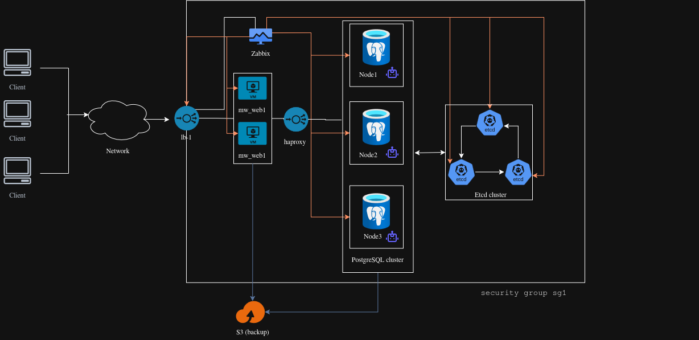

# Multi-Provider High-Availability Infrastructure & Automation Deployment

Репозиторий содержит комплексный проект автоматизации инфраструктуры (IaC). Проект ориентирован на развертывание отказоустойчивой, масштабируемой среды как в локальном контуре (On-Premise / Proxmox VE), так и в публичном облаке (Yandex Cloud).

## 🏗 Архитектура системы

<p align="center">
  
</p>

## 📌 Архитектурный стек & Компоненты

Инфраструктура спроектирована с учетом требований к высокой доступности (HA) и включает в себя следующие уровни:

* **Load Balancing:** Внешние и внутренние балансировщики Nginx и HAProxy для распределения трафика.
* **Web & Middleware Layer:** Отказоустойчивый кластер веб-серверов под управлением Nginx для обслуживания веб-приложения (MediaWiki).
* **Database & State (HA Storage):**
    * PostgreSQL с обеспечением высокой доступности.
    * Репликация и автоматический failover под управлением Patroni.
    * Консистентность кластера и распределенный распределитель блокировок (DCS) на базе etcd.
* **Monitoring & Observability:** Централизованный сервер мониторинга Zabbix Server.
* **Backup Automation:** Роли для создания резервных копий баз данных (`mwdb_backup`) и статических файлов веб-серверов (`web_backup`).

---

## 📂 Структура репозитория

text
.
├── terraform_proxmox/     # Слой IaC для локальной виртуализации (On-Premise)
│   └── modules/
│       ├── proxmox_instance   # Конфигурация виртуальных машин
│       ├── proxmox_network    # Сетевые изоляции, VLAN, подсети
│       └── proxmox_ansible    # Динамическая генерация инвентарей
│
├── terraform_yandex/      # Слой IaC для публичного облака (Yandex Cloud)
│   └── modules_yandex/
│       ├── yandex_instances   # Compute-ресурсы и группы ВМ
│       └── yandex_networks    # VPC, подсети, таблицы маршрутизации
│       
└── ansible/               # Конфигурационный менеджмент
    ├── inventory          # Описание целевых хостов по окружениям
    ├── group_vars/        # Переменные для ролей 
    └── roles/             # Роли для деплоя

## 🚀 Quick Start
> **ЕГО НЕТ. Ток мучение.**
>
### 1. Подготовка облака (Yandex Cloud)
Необходимо подготовить credentials яндекс облака (service-user и folder).

Подробнее в документации яндекса: https://yandex.cloud/ru/docs/tutorials/infrastructure-management/terraform-state-storage#linux_1

### 2. TERRAFORM с S3 remote state
Поменяйте значения на свои для удаленного стейта в файле terraform_yandex/provider.tf:
backend "s3" {
  endpoints = {
    s3 = "[https://storage.yandexcloud.net](https://storage.yandexcloud.net)" # Сторэдж S3
  }
  bucket = "ваш_бакет"
  region = "ru-central1" # Регион
  key    = "prac/instance/terraform.tfstate" # Путь в бакете

  skip_region_validation      = true
  skip_credentials_validation = true
  skip_requesting_account_id  = true 
  skip_s3_checksum            = true 
}

> 💡 *Примечание:* Можно просто удалить S3-блок из provider.tf. Останется только экспортировать свои credentials Yandex Cloud. Подробнее в доке Яндекса. 
> 
Запуск Terraform:
export YC_TOKEN=$(yc iam create-token)
export YC_CLOUD_ID=$(yc config get cloud-id)
export YC_FOLDER_ID=$(yc config get folder-id) 

terraform init
terraform plan
terraform apply

### 3. ANSIBLE
Для бэкапов нужны токены из Яндекса. В файле group_vars/all.yml укажите свои данные (секреты):
yaml
mw_db_password: "{{ vault_mw_db_password }}"
zbxdb_password: "{{ vault_zbxdb_password }}"
mediawiki_admin_pass: "{{ vault_mediawiki_admin_pass }}"
s3_key: "{{ vault_s3_key }}"
s3_secret: "{{ vault_s3_secret }}"

Запуск плейбука:
bash
ansible-playbook deploy.yml
# Или с паролем от Vault:
ansible-playbook deploy.yml --vault-pass-file=.ваш_vault

После завершения деплоя стоит зайти и прочекать Patroni-кластер, а также сам Веб + Zabbix
**Good luck, хуйли.**
```